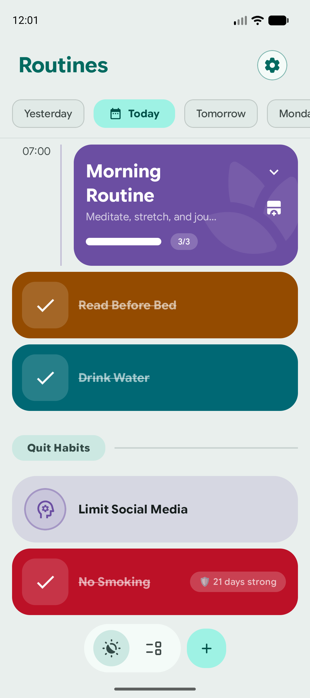
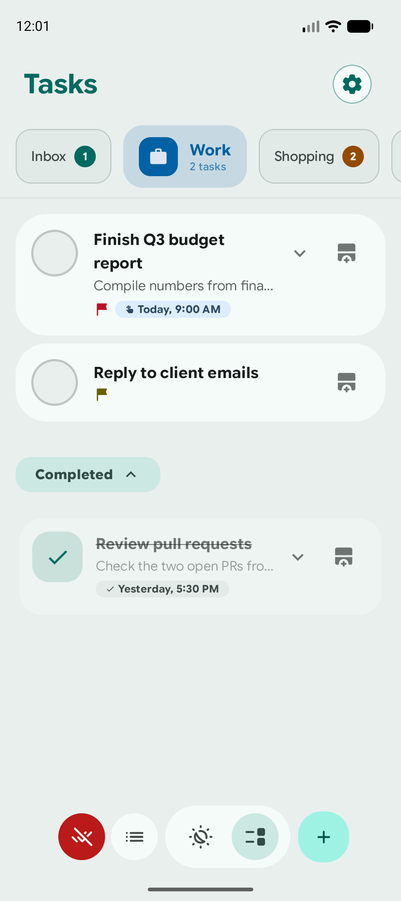
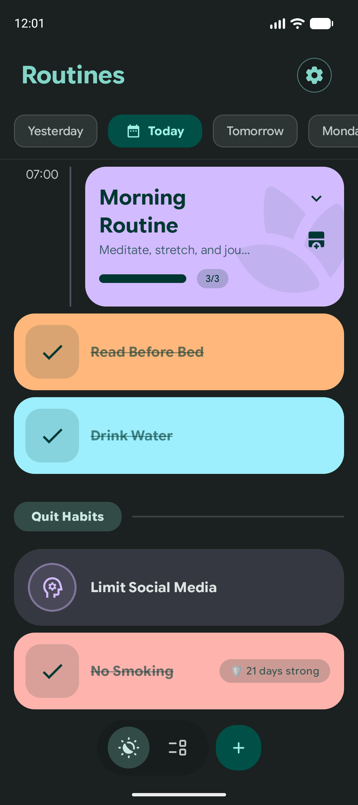
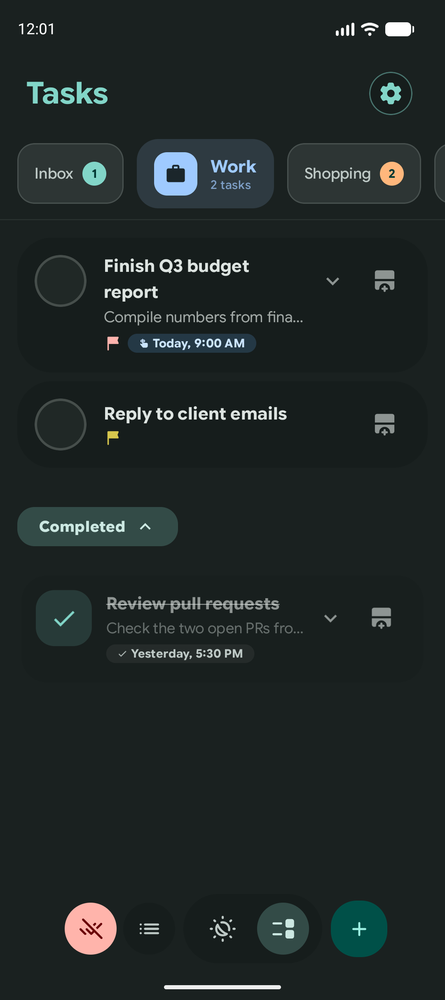

# Tempo

A native Android app for managing **tasks** and building **habits**. Tempo combines a
flexible task manager (categories, subtasks, priorities, recurring reminders) with habit
tracking built around **habit chains**, completion history, and live-activity reminder
notifications.

> Built with Kotlin and Jetpack Compose, following Clean Architecture + MVI.

## Screenshots

<p align="center">
  
  
  
  
</p>

More screenshots — Medium/Expanded tablet, Desktop, Android XR, both themes, English
and Spanish — are in [`distribution/screenshots/`](distribution/screenshots/README.md).

## Features

- **Tasks** — categories, subtasks, priorities, and recurring/periodic reminders with
  rollover handling.
- **Habits & routines** — habit chains, history visualization, and live-activity style
  reminder notifications.
- **Reminders** — exact-alarm scheduling that survives reboot and time/timezone changes.
- **Encrypted at rest** — local database (SQLCipher, Android Keystore-protected key) and
  backup exports (user passphrase) are both encrypted.
- **Theming** — Material 3 / Material You dynamic color and a configurable theme setting.
- **Localized** — English and Spanish (`values/`, `values-es/`).

## Tech stack

| Area | Choice |
|:--|:--|
| Language | Kotlin (JDK 21 toolchain) |
| UI | Jetpack Compose, Material 3, Navigation 3 |
| Architecture | Clean Architecture + MVI (Screen/Content split) |
| DI | Hilt |
| Persistence | Room, encrypted at rest via SQLCipher (schemas exported & verified in CI) |
| Async | Coroutines, `kotlinx-datetime`, `kotlinx-collections-immutable` |
| Background | WorkManager + AlarmManager reminders |
| Testing | JUnit 4, MockK, Truth, Turbine, Compose UI tests |

See [`docs/agents/TECH_STACK.md`](docs/agents/TECH_STACK.md) for the full, version-pinned list.

## Project layout

```
app/                     # The single runtime module
  src/main/java/com/mandrecode/tempo/
    core/                # Shared data, domain, di, ui
    features/            # routines, tasks, settings (domain / data / presentation)
    infrastructure/      # notifications, reminders, live activity, permissions
    util/
benchmark/               # Macrobenchmark tooling (non-runtime)
docs/                    # Architecture, design, feature & implementation docs
openspec/                # Spec-driven change workflow (changes/, specs/)
```

## Getting started

Requires **JDK 21**. The app version is read from [`version.txt`](version.txt).

```bash
./gradlew assembleDebug          # Build the debug APK
./gradlew testDebugUnitTest      # Unit tests
./gradlew koverVerifyDebug       # Coverage thresholds (80% line / 70% branch)
./gradlew ktlintCheck            # Formatting
./gradlew :app:detekt            # Static analysis
```

- **minSdk** 24 · **targetSdk / compileSdk** 37.
- Instrumented tests run on push to `main`; see [`AGENTS.md`](AGENTS.md) to run them locally.

## Contributing

Please read [`CONTRIBUTING.md`](CONTRIBUTING.md). Conventions (branches, commits, PRs,
OpenSpec workflow) are defined in [`AGENTS.md`](AGENTS.md), the single source of truth for
this project.

## Documentation

- [`AGENTS.md`](AGENTS.md) — engineering conventions & workflow
- [`docs/agents/`](docs/agents/) — per-layer reference docs (UI, Domain, Data, Testing)
- [`docs/features/`](docs/features/) · [`docs/implementation/`](docs/implementation/) ·
  [`docs/design/`](docs/design/)

## Security & privacy

- The local database and exported backups are encrypted at rest — see
  [`docs/DB_ENCRYPTION.md`](docs/DB_ENCRYPTION.md) and the
  [Encryption section](docs/BACKUP_FORMAT.md#encryption) of the backup format doc.
- Report vulnerabilities per [`SECURITY.md`](SECURITY.md).
- See the [Privacy Policy](docs/PRIVACY_POLICY.md).

## License

Licensed under the [Apache License, Version 2.0](LICENSE).
