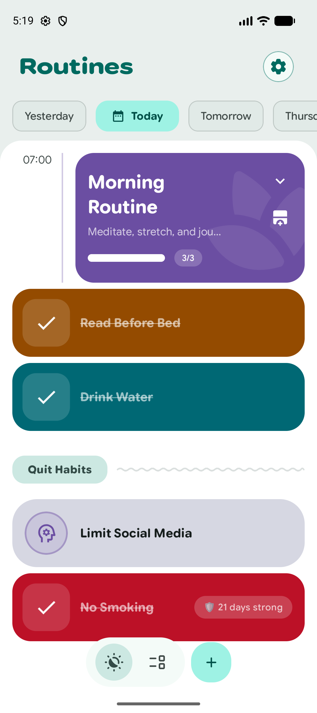
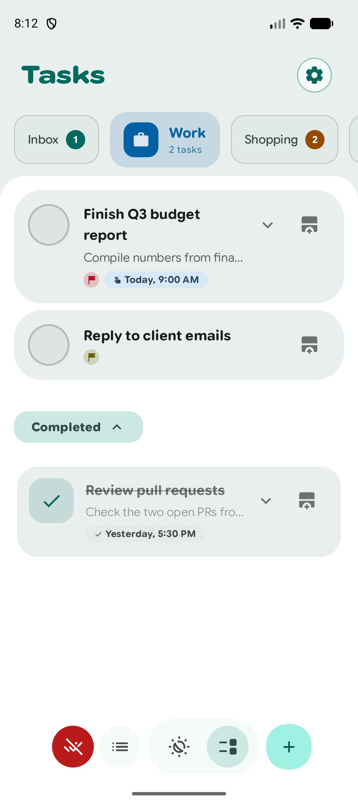
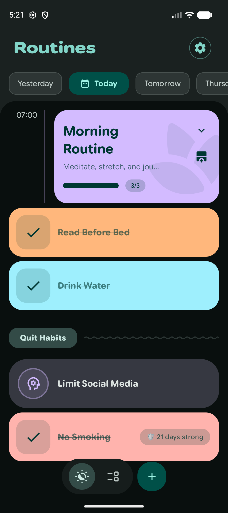
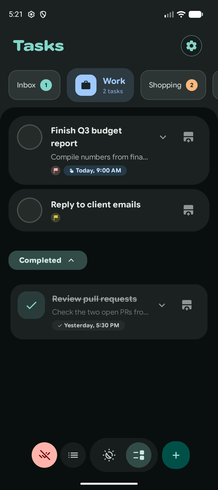

# Tempo

A native Android app for managing **tasks**, building **habits**, and actually getting the
day started. Tempo combines a flexible task manager (categories, subtasks, priorities,
recurring reminders) with habit tracking built around **habit chains**, and a **Focus** tab
that puts today's work in front of you and runs a timer against it.

> Built with Kotlin and Jetpack Compose, following Clean Architecture + MVI.

## Screenshots

<p align="center">
  
  
  
  
</p>

More screenshots — Medium/Expanded tablet, Desktop, Android XR, both themes, English
and Spanish — are in [`distribution/screenshots/`](distribution/screenshots/README.md).

## Features

- **Focus** — the tab the app opens on: an agenda of what is due today and what is overdue,
  an "Up next" shortlist you can start a timed session on, a day summary with progress, and
  a streak and history heatmap of the days you showed up.
- **Tasks** — categories, subtasks, priorities, and recurring/periodic reminders with
  rollover handling, plus optional auto-removal of completed tasks.
- **Habits & routines** — habit chains, history visualization, and live-activity style
  reminder notifications.
- **Reminders** — exact-alarm scheduling that survives reboot and time/timezone changes,
  with a daily catch-up sweep for reminders that were missed while the phone was off.
- **Vacation mode** — pause every habit at once, with an optional end date, without
  breaking streaks.
- **Home-screen widget** — quick-add a task without opening the app.
- **Backup & restore** — versioned export/import with conflict reporting and merge modes.
- **Encrypted at rest** — local database (SQLCipher, Android Keystore-protected key) and
  backup exports (user passphrase) are both encrypted.
- **Onboarding & what's new** — a first-run setup flow with notification-permission
  education, and a one-off sheet announcing the latest feature after an update.
- **Adaptive** — one layout across phone, foldable, tablet, desktop and Android XR, with a
  floating navigation bar that becomes a rail on wider windows.
- **Theming** — Material 3 / Material You dynamic color and a configurable theme setting.
- **Localized** — English and Spanish (`values/`, `values-es/`).

## Tech stack

| Area | Choice |
|:--|:--|
| Language | Kotlin (JDK 21 toolchain) |
| UI | Jetpack Compose, Material 3, Navigation 3 |
| Architecture | Clean Architecture + MVI (Screen/Content split) |
| DI | Hilt |
| Persistence | Room, encrypted at rest via SQLCipher (schemas exported & verified in CI) |
| Async | Coroutines, `kotlinx-datetime`, `kotlinx-collections-immutable` |
| Background | WorkManager + AlarmManager reminders |
| Testing | JUnit 4, MockK, Truth, Turbine, Compose UI tests |

See [`docs/agents/TECH_STACK.md`](docs/agents/TECH_STACK.md) for the full, version-pinned list.

## Project layout

```
app/                     # The single runtime module
  src/main/java/com/mandrecode/tempo/
    core/                # Shared data, domain, di, ui
    features/            # tasks, routines, focus, settings, backup,
                         #   onboarding, whatsnew, widget (domain / data / presentation)
    infrastructure/      # notifications, reminders, focus sessions, live activity,
                         #   backup, security, permissions
    util/
benchmark/               # Macrobenchmark tooling (non-runtime)
distribution/            # Store listing assets and generated screenshots
docs/                    # Architecture, design, feature & implementation docs
openspec/                # Spec-driven change workflow (changes/, specs/)
```

## Getting started

Requires **JDK 21**. The app version is read from [`version.txt`](version.txt).

```bash
./gradlew assembleDebug          # Build the debug APK
./gradlew testDebugUnitTest      # Unit tests
./gradlew koverVerifyDebug       # Coverage thresholds (80% line / 70% branch)
./gradlew ktlintCheck            # Formatting
./gradlew :app:detekt            # Static analysis
```

- **minSdk** 24 · **targetSdk / compileSdk** 37.
- Instrumented tests run on push to `main`; see [`AGENTS.md`](AGENTS.md) to run them locally.

## Contributing

Please read [`CONTRIBUTING.md`](CONTRIBUTING.md). Conventions (branches, commits, PRs,
OpenSpec workflow) are defined in [`AGENTS.md`](AGENTS.md), the single source of truth for
this project.

## Documentation

- [`docs/README.md`](docs/README.md) — index of every doc, with what each one is for
- [`AGENTS.md`](AGENTS.md) — engineering conventions & workflow
- [`docs/agents/`](docs/agents/) — per-layer reference docs (UI, Domain, Data, Testing,
  Tech stack)
- [`openspec/changes/`](openspec/changes/) — the proposal, design and spec deltas behind each
  feature, including the archived ones. The closest thing to a per-feature changelog with
  reasoning attached.
- [`CHANGELOG.md`](CHANGELOG.md) — released versions

## Security & privacy

- The local database and exported backups are encrypted at rest — see
  [`docs/DB_ENCRYPTION.md`](docs/DB_ENCRYPTION.md) and the
  [Encryption section](docs/BACKUP_FORMAT.md#encryption) of the backup format doc.
- Report vulnerabilities per [`SECURITY.md`](SECURITY.md).
- See the [Privacy Policy](docs/PRIVACY_POLICY.md).

## License

Licensed under the [Apache License, Version 2.0](LICENSE).
